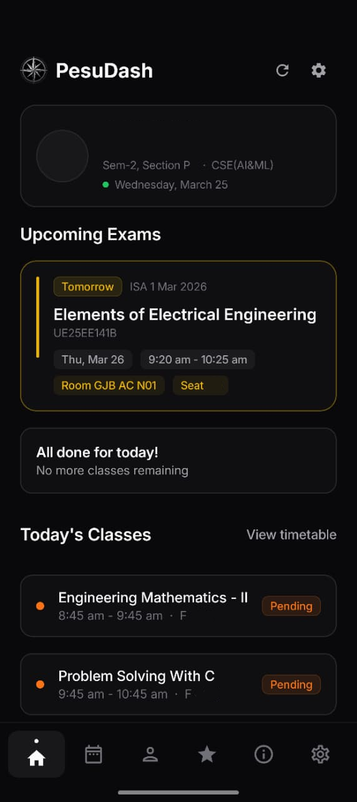
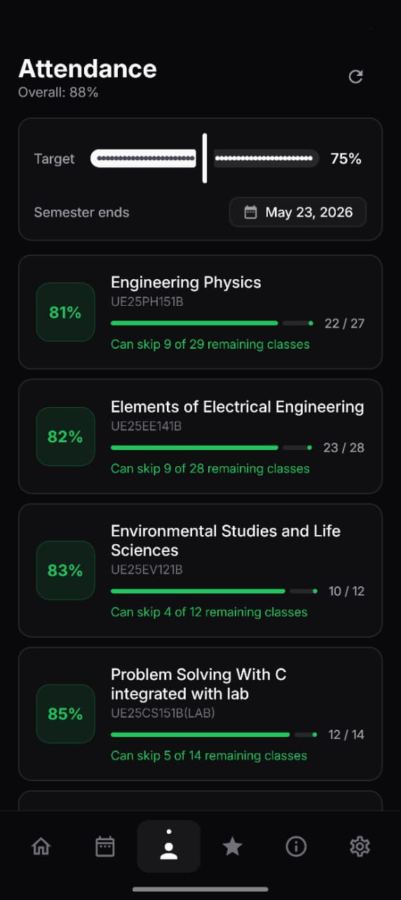
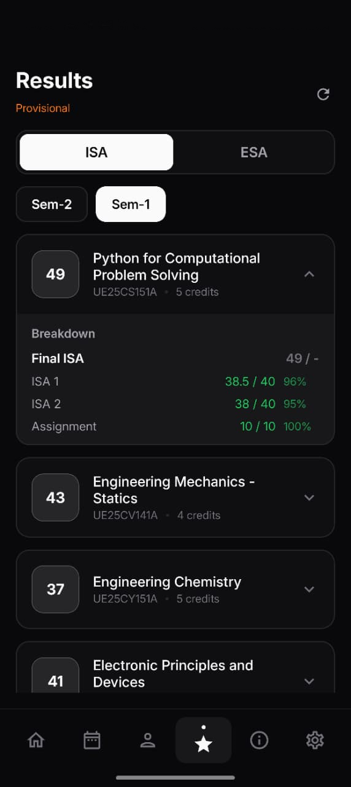

# PesuDash

An unofficial companion app for PES University students (RR & EC campuses).  
Built with Kotlin + Jetpack Compose.

<p align="center">
  
  
  
</p>

---

## Download

[**Latest Release →**](https://github.com/Vision2822/pesu-dash/releases/latest)

Download the APK from the releases page and install it directly on your Android device.  
Enable **Install from unknown sources** if prompted.

---

## Features

### Today's Classes

Live timetable with real-time attendance status per class.  
Scroll back through the past 14 days to check attendance for any date.

### Attendance

Full subject-wise attendance breakdown with smart advice:

- See how many classes you can skip or need to attend
- Set your own target percentage
- Set semester end date for accurate projections

### Results

- **ISA** — View marks for all assessments across all semesters (ISA 1, ISA 2, Assignments, MATLAB etc)
- **ESA** — Finalised semester grades with SGPA, CGPA and credit summary
- Expandable subject cards with color coded performance indicators

### Exam Seating

Room number and seat assignment for upcoming and ongoing exams.  
Cached so it works offline once loaded.

### Home

Quick dashboard showing:

- Next or ongoing class
- Low attendance subjects
- Upcoming exams
- Overall attendance

### Widget

Home screen widget with live attendance stats.  
Know if you were marked present without opening the app.

### Themes

Dark, light, and system mode with a custom accent color picker.

---

## Compatibility

|              |                                                  |
| ------------ | ------------------------------------------------ |
| **Campuses** | RR & EC                                          |
| **Login**    | PESU Academy credentials (SRN starting with PES) |
| **Android**  | 8.0 and above (API 26+)                          |

---

## How It Works

PesuDash uses the same API as the official PESU Academy mobile app.  
Your credentials are sent **only** to PESU Academy servers — never stored or transmitted anywhere else.  
Sessions last approximately 2 weeks before re-login is required.

---

## Building from Source

```bash
git clone https://github.com/Vision2822/pesu-dash.git
```

Open the `pesu-dash` folder in Android Studio.  
Let Gradle sync complete.  
Run on a device or emulator with Android 8.0+.

No API keys or additional setup required.

---

## Disclaimer

This is an **unofficial** app and is not affiliated with, endorsed by, or connected to PES University in any way.  
Use at your own discretion.

---

## Author

**Prajval**  
[github.com/Vision2822](https://github.com/Vision2822)

---

## License

This project is open source. Feel free to fork, modify and use it.  
If you build something cool with it, a credit would be appreciated.
